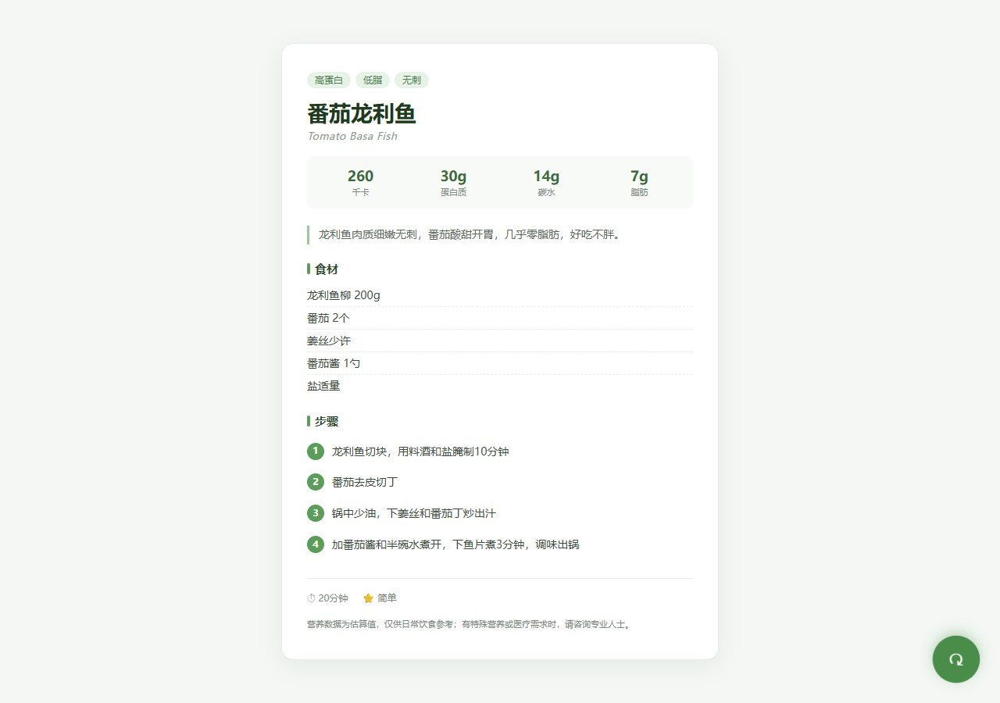

# 今日减脂菜谱

一个零依赖的随机菜谱小应用，用于快速决定今天吃什么。

**在线演示：** https://limn12.github.io/healthy-recipe-picker/

## 功能

- 内置 10 道减脂友好菜谱
- 展示估算热量、蛋白质、碳水和脂肪
- 包含食材、烹饪步骤、耗时与难度
- 随机切换时避免连续出现同一道菜
- 适配手机屏幕、键盘焦点和减少动画偏好

## 运行

下载代码后，用现代浏览器打开 `index.html`。项目不需要安装依赖，也不会发送网络请求。

## 健康声明

页面中的营养数据是估算值，仅供日常饮食参考，不替代医生或注册营养师的专业建议。

## 技术

HTML5、CSS3、Vanilla JavaScript。

